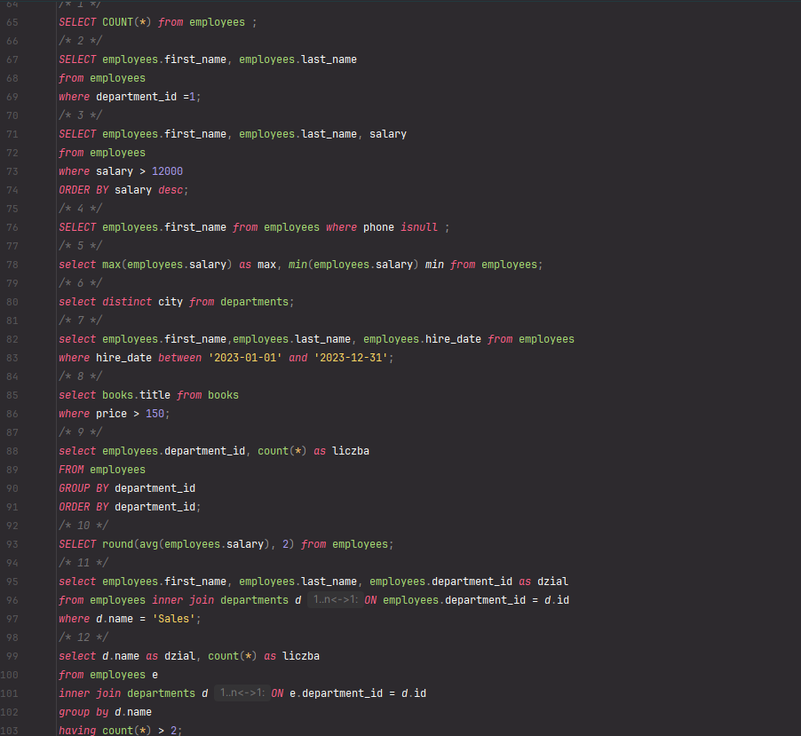
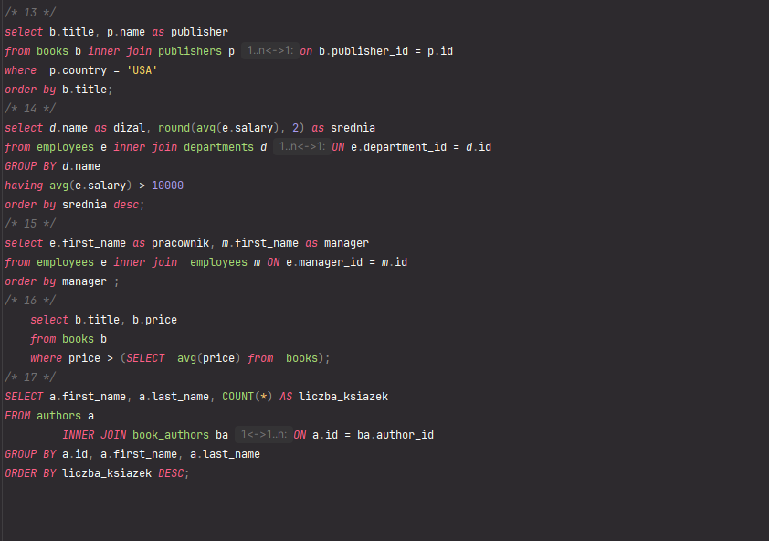

## Sekcja 0 — Docker i PostgreSQL

**Po co używamy flagi `-v kurs_pg_data:/var/lib/postgresql/data` w `docker run`? Co zniknie, jeśli ją pominiemy?**

Znikną dane w bazie za każdym razem, gdy kontener przestanie działać.

**Czemu mapujemy port `-p 5432:5432`? Co znaczą obie liczby?**

Mapujemy port, żeby powiedzieć, na jakim porcie będziemy działać — od `:` do (port hosta : port kontenera).

**Jak sprawdzisz logi działającego kontenera?**

```bash
docker logs kurs-postgres
```

**Polecenie `\dt` w psql — co zwraca? A `\d users`?**

Lista tabel w bieżącej bazie.

**Jak całkowicie usunąć bazę razem z danymi i zacząć od zera?**

```bash
# Zatrzymaj i usuń kontener
docker rm -f kurs-postgres
 
# Usuń wolumen z danymi
docker volume rm kurs_pg_data
 
# Sprawdź, że wolumen zniknął
docker volume ls | grep kurs_pg_data
# powinno nic nie zwrócić
```

…a następnie odtworzenie od zera:

```bash
docker run -d \
  --name kurs-postgres \
  -e POSTGRES_PASSWORD=kurs123 \
  -e POSTGRES_USER=kurs \
  -e POSTGRES_DB=kursdb \
  -p 5432:5432 \
  -v kurs_pg_data:/var/lib/postgresql/data \
  postgres:16
```
 
---

## 1. DDL — typy kolumn, klucze podstawowe i obce

**Czym `GENERATED ALWAYS AS IDENTITY` różni się od `SERIAL`?**

Oba są auto-increment `int`, ale `SERIAL` (legacy) tworzy ukrytą sekwencję, którą można nadpisać ręcznie, podczas gdy `GENERATED ALWAYS AS IDENTITY` blokuje ręczne wstawianie.

**Czemu na pieniądze używamy `NUMERIC(12,2)`, a nie `REAL`?**

Ponieważ typ `REAL` działa podobnie jak `double` w Javie — czasem przy działaniach takich jak `0.2 + 0.3` wynik jest trochę za duży albo za mały, np. `0.50000003`.

**Co robi `ON DELETE CASCADE` w `book_authors`? Co by się stało, gdyby było `RESTRICT`?**

`CASCADE` usuwa wszystkie wiersze powiązane z danym obiektem. `RESTRICT` — wyświetli komunikat i zablokuje usunięcie, dopóki istnieją powiązania.

**Czemu klucz główny w tabeli pośredniczącej `book_authors` to para kolumn `(book_id, author_id)`?**

Pokazuje zależność wiele-do-wielu.

**Co robi `\d books` w psql?**

Wyświetla strukturę tabeli: kolumny, typy, które są `NOT NULL`, indeksy i constrainty.

**Jak dodać nową kolumnę z wartością domyślną do istniejącej tabeli?**

```sql
ALTER TABLE nazwa ADD COLUMN ... DEFAULT ...;
```

**Czym różni się `VARCHAR(200)` od `TEXT`?**

`VARCHAR(200)` ogranicza liczbę dozwolonych znaków do 200, a `TEXT` ma nieograniczony zakres.

**Co zrobi `DROP TABLE books;`, jeśli istnieją wiersze w `book_authors` referujące do `books`?**

Pokaże błąd — nie można usunąć.
 
---

## 2. Klucze i ograniczenia (constraints)

**Czemu `PRIMARY KEY` to `NOT NULL` + `UNIQUE`?**

Ponieważ `PRIMARY KEY` to tak jak numer ID — nie może być `NULL` i musi być unikalny, żeby się nie powtarzał.

**Czym `UNIQUE (a, b)` różni się od `UNIQUE (a), UNIQUE (b)`?**

`UNIQUE (a, b)` oznacza, że żaden wiersz nie może mieć tej samej **pary** wartości. `UNIQUE (a)` oznacza, że pojedyncza wartość w kolumnie `a` nie może się powtórzyć.

**Co robi `ON DELETE CASCADE`?**

Usuwa obiekt wraz z jego "dziećmi".

**Co robi `ON DELETE SET NULL`? Kiedy się przyda?**

Usuwa rodzica, a u dziecka zmienia wartość klucza obcego na `NULL`.

**Kiedy lepiej `RESTRICT`, a kiedy `CASCADE`?**

`RESTRICT` to bezpieczny typ — gdy nie chcemy usuwać rodzica, dopóki ma jakieś dzieci. `CASCADE` — gdy chcemy usunąć rodzica razem z dziećmi.

**Czy można dodać `NOT NULL` do istniejącej kolumny z `NULL`-ami?**

Tak, ale najpierw trzeba je wypełnić danymi.

**Co robi `CHECK (check_out > check_in)`?**

`CHECK` to mini-reguła biznesowa — pokazuje, że data wymeldowania musi być po dacie zameldowania.
 
---

## 3. DML — INSERT, UPDATE, DELETE, transakcje

**Co się stanie, gdy napiszesz `UPDATE books SET price = 0;` bez `WHERE`?**

Dostaniemy ostrzeżenie, że `UPDATE` bez `WHERE` zmieni cenę wszystkich wierszy w tabeli — i pytanie, czy na pewno chcemy to zrobić.

**Po co `RETURNING` w `INSERT`?**

Po to, by można było wyświetlić dane właśnie wstawionego wiersza bez używania kolejnego zapytania.

**Czemu `INSERT` jednym poleceniem wielu wierszy jest szybszy niż 1000 osobnych `INSERT`-ów?**

Ponieważ to tylko jedno polecenie, jedna transakcja, mniej narzutu.

**Co robi `BEGIN; ... ROLLBACK;`?**

To transakcja: wszystko albo powrót do poprzedniego stanu.

**Czym `SAVEPOINT` różni się od pełnego `ROLLBACK`?**

`SAVEPOINT` to rollback częściowy (np. tylko fragmentu transakcji), a `ROLLBACK` wycofuje wszystko od `BEGIN`.

**Po `COMMIT` da się jeszcze cofnąć zmiany?**

Nie. Po `COMMIT` zmiany zostają utrwalone i są widoczne dla wszystkich.

**Dlaczego nie udało się usunąć wydawnictwa Pearson?**

`books` ma klucz obcy, a Pearson ma przypisane książki — `RESTRICT` to blokuje.

**Co zrobi `DELETE FROM book_orders;` (bez `WHERE`) w transakcji bez `COMMIT`/`ROLLBACK`?**

Usuwa z `book_orders` wszystkie dane.
 
---

## 4. SELECT podstawowy — WHERE, AND/OR, BETWEEN, IN, LIKE, IS NULL

**Czemu `WHERE phone = NULL` jest zawsze fałszywe? Co napisać zamiast tego?**

Porównanie z `NULL` daje `UNKNOWN`, więc nigdy nie jest prawdą. Zamiast tego piszemy `WHERE phone IS NULL`.

**Czym `LIKE` różni się od `ILIKE` w PostgreSQL?**

`LIKE` rozróżnia wielkość liter, a `ILIKE` nie.

**Co znaczą `%` i `_` w `LIKE`?**

`%` — dowolny ciąg znaków (np. `A%` = zaczyna się na A, `%a` = kończy się na a). `_` — dokładnie 1 znak.

**`BETWEEN 9000 AND 12000` — czy granice są włączone, czy wyłączone?**

Włączone.

**Czemu pisanie `WHERE is_active = TRUE` można skrócić do `WHERE is_active`?**

Ponieważ warunek i tak sprawdza domyślnie wartość `TRUE`.

**Co zwróci `SELECT 5 IN (1, 2, NULL)`? A `SELECT 5 NOT IN (1, 2, NULL)`?**

`NULL` i `NULL`.

**Czy `LIKE 'A%'` znajdzie „anna"? A `ILIKE 'A%'`?**

`LIKE` nie znajdzie, a `ILIKE` znajdzie.
 
---

## 5. Sortowanie i ograniczenia — ORDER BY, LIMIT, OFFSET, DISTINCT

**Czym `ORDER BY salary` różni się od `ORDER BY salary DESC`?**

Pierwsze sortuje rosnąco (ascending), drugie malejąco (descending).

**Co zrobi `ORDER BY 2` — sortuje po której kolumnie?**

Po drugiej kolumnie.

**Co robi `NULLS LAST`?**

Umieszcza `NULL` na końcu (domyślnie są traktowane jako największe).

**Jak działają `LIMIT` i `OFFSET` razem przy paginacji?**

`LIMIT` zwraca maksymalnie X wyników, a `OFFSET` pomija X pierwszych wierszy.

**Czym `DISTINCT` różni się od `DISTINCT ON (kolumna)` w PostgreSQL?**

`DISTINCT` zwraca unikalne kombinacje, a `DISTINCT ON` zwraca po jednym wierszu dla każdej wartości danej kolumny.

**Czy `LIMIT 5` bez `ORDER BY` zawsze zwraca te same 5 wierszy? Czemu nie?**

Nie — może zwrócić różne, ponieważ bez `ORDER BY` nie określiliśmy kolejności.
 
---

## 6. Agregacje — COUNT, SUM, AVG, MIN, MAX, GROUP BY, HAVING

**Czym `WHERE` różni się od `HAVING`?**

`WHERE` filtruje pojedyncze wiersze, a `HAVING` filtruje całe grupy po agregacji.

**Czemu `SELECT id, COUNT(*) FROM employees GROUP BY department_id;` zwróci błąd?**

Ponieważ kolumna `id` musi znaleźć się w `GROUP BY` (albo być w funkcji agregującej).

**Co liczy `COUNT(*)`, a co `COUNT(phone)` przy 12 wierszach z 8 nie-`NULL` telefonami?**

`COUNT(*)` liczy wszystkie wiersze (12, łącznie z `NULL`), a `COUNT(phone)` liczy tylko te, gdzie `phone` nie jest `NULL` (8).

**Czemu `AVG(salary)` na pustej tabeli zwraca `NULL`, a nie `0`?**

Ponieważ `NULL` to brak wartości, a nie zero — `0` byłoby konkretną wartością, której tu nie ma.

**Kiedy `HAVING` może istnieć bez `GROUP BY`?**

Kiedy mamy tylko jedną grupę.

**Co robi `COUNT(DISTINCT manager_id)`?**

Liczy różne (unikalne) wartości `manager_id`.

**Czym `FILTER (WHERE ...)` różni się od ogólnego `WHERE` w tym samym zapytaniu?**

`FILTER` pozwala policzyć kilka różnych warunków w jednym przebiegu zapytania.
 
---

## 7. Łączenie tabel — JOIN

**Czym różni się `INNER JOIN` od `LEFT JOIN`?**

`INNER JOIN` zwraca wiersze, które mają parę po obu stronach. `LEFT JOIN` zachowuje wszystkie wiersze z lewej tabeli.

**Co zwróci `LEFT JOIN`, jeśli z prawej strony nie ma dopasowania?**

Zwróci `NULL` w kolumnach z prawej tabeli.

**Czemu `RIGHT JOIN` jest rzadko używany w praktyce?**

To `LEFT JOIN` na opak — rzadko używany, bo można po prostu zamienić tabele miejscami.

**Kiedy ma sens `FULL OUTER JOIN`?**

Kiedy chcemy zachować wartości z obu stron i wstawić `NULL` tam, gdzie nie ma dopasowania.

**Po co aliasy `employees e, departments d`?**

Aliasy służą do skracania nazw — zamiast `employees.first_name` piszemy `e.first_name`, co przy kilku tabelach mocno skraca i rozjaśnia zapytanie.

**Co robi `JOIN ... USING (id)` vs `JOIN ... ON a.id = b.id`?**

Po `USING (id)` w wyniku jest jedna scalona kolumna `id`, a po `ON a.id = b.id` masz dwie osobne kolumny `id`.

**Jaka jest typowa liczba wierszy w `CROSS JOIN` z dwóch tabel n = 10 i m = 5?**

50 — bo łączymy każdy wiersz z lewej z każdym z prawej.

**Co to „self-join" i kiedy go używamy?**

Tabela złączona sama ze sobą pod dwoma aliasami — używamy go, gdy chcemy operować na różnych wierszach z tej samej tabeli.
 
---

## 8. Podzapytania (subqueries)

> W `WHERE`, `FROM`, `SELECT`; korelowane vs niekorelowane.

**Czym scalar subquery różni się od subquery zwracającego wiele wierszy?**

Scalar zwraca jedną wartość, która jest używana jak pojedyncza liczba.

**Czym korelowane subquery różni się od niekorelowanego?**

Różnica jest wydajnościowa. Niekorelowane jest samodzielne — baza liczy je raz i wstawia wynik. Korelowane odwołuje się do kolumny z zapytania zewnętrznego (liczone dla każdego wiersza).

**Czemu `EXISTS` jest często szybsze niż `IN (subquery)`?**

`EXISTS` patrzy tylko, czy podzapytanie cokolwiek zwraca, a `IN` sprawdza, czy wartość jest na całej liście zwróconej przez podzapytanie.

**Dlaczego `NOT IN (subquery)` z `NULL`-em zachowuje się nieintuicyjnie?**

Jeśli podzapytanie w `NOT IN` zwróci choć jeden `NULL`, całość przez logikę trójwartościową zwykle daje zero wierszy — wynik, którego nikt się nie spodziewa.

**Kiedy lepiej użyć `JOIN`-a zamiast subquery? Co decyduje?**

Gdy chcesz kolumny z drugiej tabeli — `JOIN`. Gdy chcesz tylko sprawdzić istnienie albo porównać z wyliczoną wartością — podzapytanie.

**Co robi `WHERE x > ALL (SELECT y FROM ...)`?**

Wybiera wiersze, w których `x` jest większe niż **wszystkie** wartości `y` zwrócone przez podzapytanie.

**Czemu subquery w `FROM` zawsze musi mieć alias?**

Ponieważ `FROM` zwraca tymczasową tabelę, która musi mieć nazwę.
 
---

## 9. Indeksy — CREATE INDEX, EXPLAIN

**Co robi indeks B-drzewa pod spodem?**

Indeks wie, jaka wartość znajduje się na danym miejscu, więc kiedy czegoś szukamy, B-drzewo „mówi" idź w lewo albo w prawo — dzięki temu połowa wyników jest odrzucana za każdym razem.

**Czemu indeksy nie są darmowe?**

Są przypisane do kolumny — przyspieszają odczyt, ale muszą być aktualizowane przy każdym `INSERT`/`UPDATE`/`DELETE`, dlatego spowalniają zapis.

**Które kolumny warto indeksować?**

Te, po których filtrujemy albo na których często działamy — nie indeksuje się wszystkiego.

**Które kolumny nie warto indeksować?**

Kolumny przechowujące np. tylko 2 wartości (np. `boolean` — `TRUE`/`FALSE`), bo nawet po zaindeksowaniu odrzucamy tylko połowę.

**Czemu `PRIMARY KEY` ma automatyczny indeks, a `FK` nie?**

`PK` dostaje indeks automatycznie, bo baza musi pilnować jego unikalności (a bez indeksu nie ma jak). `FK` nie wymaga indeksu do działania, ale w praktyce warto go indeksować.

**Czym `EXPLAIN` różni się od `EXPLAIN ANALYZE`?**

`EXPLAIN` pokazuje plan, który baza zamierza wykonać (bez uruchamiania). `EXPLAIN ANALYZE` faktycznie wykonuje zapytanie i podaje realne czasy.

**Co to indeks częściowy i kiedy się przydaje?**

Indeks częściowy indeksuje tylko wiersze spełniające warunek — jest mniejszy i przydaje się, gdy regularnie odpytujesz wąski wycinek tabeli.

**Co to indeks funkcyjny (expression index)?**

Indeks funkcyjny indeksuje wynik wyrażenia/funkcji, a nie samą kolumnę — bo zwykły indeks na kolumnie wtedy nie zadziała.
 
---

## 10. Widoki — VIEW i MATERIALIZED VIEW

**Czym `VIEW` różni się od `MATERIALIZED VIEW`?**

`VIEW` to zapisane zapytanie, którego można potem użyć jak tabeli, ale nie przechowuje danych na dysku. `MATERIALIZED VIEW` przechowuje dane na dysku.

**Czemu dane w `MATERIALIZED VIEW` mogą być nieświeże?**

Ponieważ zostały pobrane i zapisane na dysku — w międzyczasie ktoś może coś dodać/usunąć/zmodyfikować. Trzeba zrobić `REFRESH`, żeby dostać nowe dane.

**Kiedy używać `VIEW`, a kiedy `MATERIALIZED VIEW`?**

`VIEW` — gdy dane często się zmieniają, a wywołanie nie zajmuje dużo czasu. `MATERIALIZED VIEW` — do raportów/dashboardów aktualnych na godzinę albo dzień.

**Czy można robić `INSERT`/`UPDATE` przez `VIEW`?**

Tylko przez proste widoki: jedna tabela, bez `JOIN`, `GROUP BY` czy `DISTINCT`.

**Co robi `REFRESH MATERIALIZED VIEW CONCURRENTLY`?**

Pozwala czytać stare dane w trakcie odświeżania.

**Czy `VIEW` z `JOIN` lub `GROUP BY` jest zwykle updatowalny?**

Nie.

